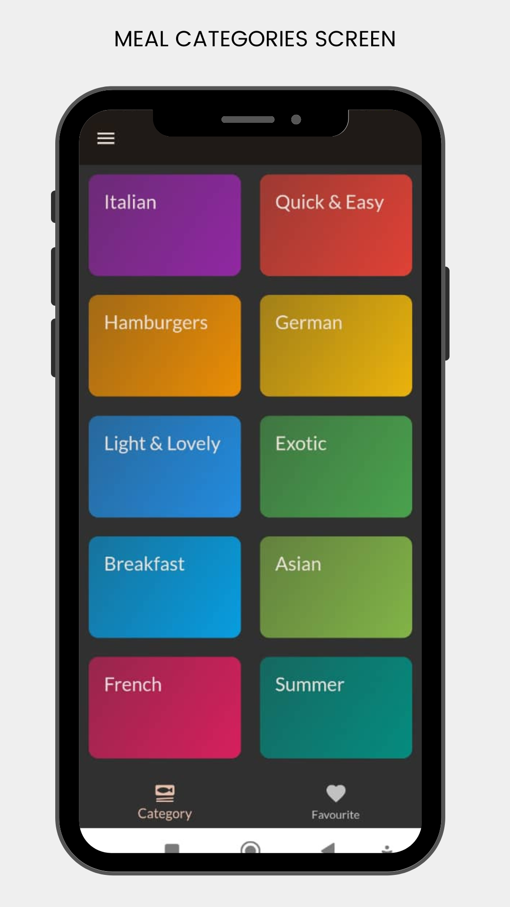
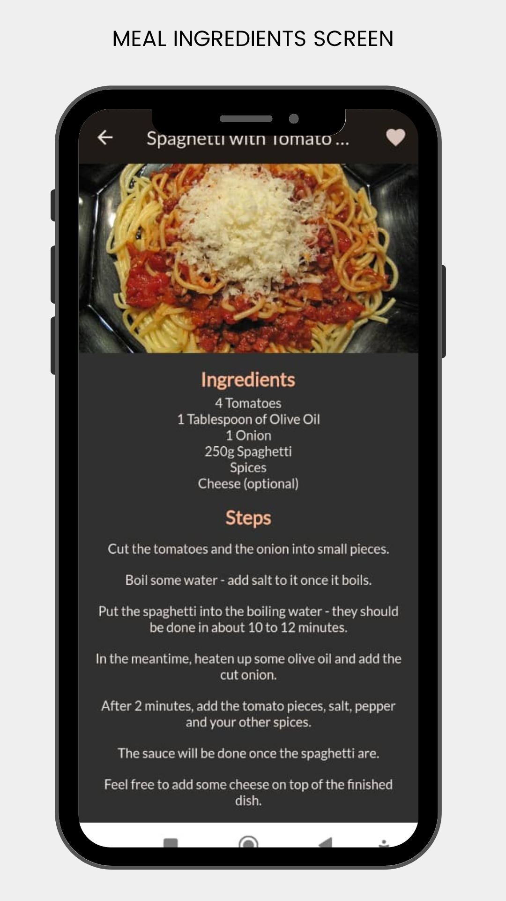
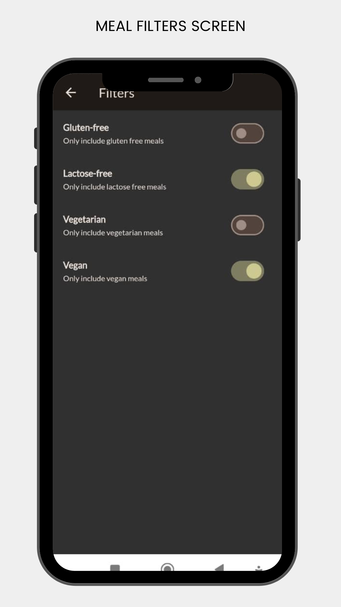

# Meals App

Welcome to Meals App, built with flutter.

## Description
The meals app allow users to:
- Browse meals categories
- Choose and navigate to read meals incredients
- Mark meals as favourite
- Apply filters (Vegan, gluten-free etc.)

## Flutter concepts demonstrated in the project
1. Riverpod state management
2. Managing Screen stacks
3. Working with tabs abd side Drawers
4. App theming
5. Firebase database
6. Feature-first Architecture
7. Shared preferences
8. Dart extension and more

## Getting Started
The first step to testing or running this app is getting the code

    git clone https://github.com/kennethOkwong/Meals-App.git
    .
    .
    flutter pub get

Run the app to confirm that everything works
    
    flutter run

## App Features
Major app screens are shown below:

### Browsing Meal Categories

### Meal preparation details

### Meal filters

